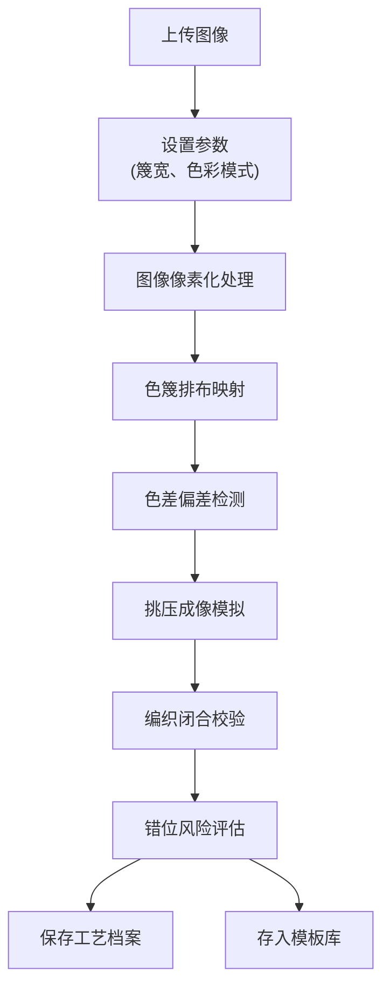

## 1. 产品概述

竹篾染色编画色篾排布与挑压成像生产力系统，是一款面向传统竹编画工艺的数字化设计工具。通过将图像转换为篾条挑压成像方案，实现传统工艺与现代技术的融合，提升竹编画创作效率与精度。

- **核心价值**：将图像自动转化为可编织的挑压方案，辅助工艺师进行色篾排布规划
- **目标用户**：竹编工艺师、传统工艺美术从业者、非遗传承人
- **解决问题**：人工挑压设计效率低、色篾用量估算难、色差与错位风险不可控

## 2. 核心功能

### 2.1 用户角色

| 角色 | 注册方式 | 核心权限 |
|------|----------|----------|
| 工艺师用户 | 本地使用，无需注册 | 图像导入、方案生成、档案管理、模板保存 |

### 2.2 功能模块

1. **图像解析页**：图像导入、像素化处理、黑白/多色模式切换、分辨率与篾宽计算
2. **色篾排布页**：经纬篾挑压映射、色篾染色用量规划、排布序列生成、色差偏差标红
3. **挑压成像页**：远观/近看视觉模拟、编织闭合校验、边缘收口检测、错位风险预警
4. **工艺档案页**：作品信息记录、成像方案存档、工艺参数追溯、档案搜索管理
5. **模板库页**：模板分类浏览、模板保存复用、模板导入导出、模板预览比对

### 2.3 页面详情

| 页面名称 | 模块名称 | 功能描述 |
|----------|----------|----------|
| 图像解析页 | 图像上传区 | 支持拖拽上传、本地选择、示例图像加载 |
| 图像解析页 | 参数设置区 | 篾宽调节、色彩模式切换、对比度/亮度调节 |
| 图像解析页 | 预览展示区 | 原图与像素化效果对比、画幅尺寸计算显示 |
| 色篾排布页 | 经纬网格区 | 展示经篾纬篾交错网格、挑压状态可视化 |
| 色篾排布页 | 色篾调色板 | 预设色篾颜色、自定义颜色、染色用量统计 |
| 色篾排布页 | 色差检测区 | 识别染色不均区域、红色标记偏差位置、偏差程度分级 |
| 挑压成像页 | 视觉模拟区 | 远观/近看切换、缩放平移浏览、实时渲染成像效果 |
| 挑压成像页 | 编织校验区 | 闭合性检测、边缘收口分析、错位风险预警 |
| 挑压成像页 | 方案输出区 | 挑压序列导出、编织步骤说明、用料清单生成 |
| 工艺档案页 | 档案列表区 | 作品卡片展示、搜索筛选、分页浏览 |
| 工艺档案页 | 档案详情区 | 作品信息、成像方案、工艺参数、历史版本 |
| 工艺档案页 | 档案操作区 | 新建档案、编辑保存、删除归档、导出报告 |
| 模板库页 | 模板分类区 | 按题材/难度/尺寸分类、分类导航 |
| 模板库页 | 模板展示区 | 模板缩略图网格、模板信息悬浮展示 |
| 模板库页 | 模板操作区 | 应用模板、收藏模板、导入导出、删除管理 |

## 3. 核心流程

用户上传图像 → 调整篾宽与色彩参数 → 系统生成像素化映射 → 查看色篾排布与挑压方案 → 模拟远观近看效果 → 校验编织可行性 → 保存为工艺档案/加入模板库

## 4. 用户界面设计

### 4.1 设计风格

- **主色调**：竹青色 `#6B8E23` 作为主色，体现竹篾自然质感
- **辅助色**：米黄色 `#F5F0E1` 背景色、深棕色 `#4A3728` 文字色、赭红色 `#B85450` 强调色
- **按钮风格**：圆角矩形、微立体边框、悬停时轻微上浮
- **字体**：标题使用衬线字体体现传统韵味，正文使用现代无衬线字体保证可读性
- **布局风格**：卡片式布局、留白充足、视觉层次清晰
- **装饰元素**：竹纹纹理背景、编织图案分隔线、传统纹样边角装饰

### 4.2 页面设计概览

| 页面名称 | 模块名称 | UI元素 |
|----------|----------|--------|
| 图像解析页 | 顶部导航 | 竹叶图标、页面标题、导航菜单、主题切换 |
| 图像解析页 | 上传区域 | 虚线边框上传框、竹编纹理背景、拖拽动画 |
| 图像解析页 | 参数面板 | 滑动条控件、下拉选择器、实时数值显示 |
| 色篾排布页 | 网格画布 | 经纬线交错、挑压状态用颜色区分 |
| 色篾排布页 | 侧边面板 | 色卡列表、用量统计、偏差告警列表 |
| 挑压成像页 | 中央画布 | 成像效果渲染、视图切换按钮、缩放控件 |
| 挑压成像页 | 底部状态栏 | 校验结果图标、风险等级指示、操作按钮 |
| 工艺档案页 | 列表卡片 | 缩略图、作品名称、创建时间、标签 |
| 模板库页 | 网格布局 | 模板卡片、分类标签、收藏状态标记 |

### 4.3 响应式设计

- 采用桌面优先设计，兼顾平板设备适配
- 侧边面板在小屏幕下可折叠收起
- 画布区域自适应窗口大小，支持全屏模式
- 触摸设备优化手势缩放与平移

### 4.4 动效设计

- 页面切换采用淡入淡出过渡
- 图像上传时有进度条动画
- 色篾网格生成时有逐步绘制动画
- 远观/近看切换时有平滑缩放过渡
- 告警标红时有脉冲闪烁效果引起注意
