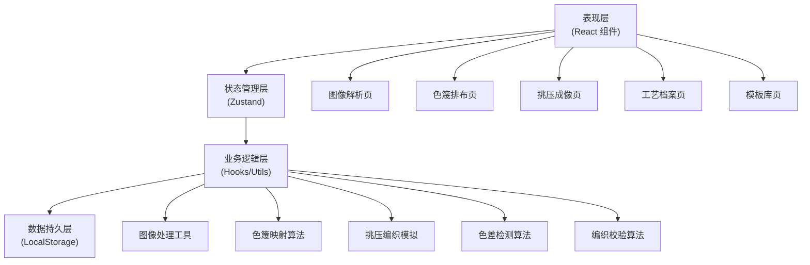

## 1. 架构设计

本系统为纯前端应用，采用React单页应用架构，所有图像处理、色篾计算、成像模拟均在浏览器端完成，数据通过LocalStorage持久化存储。



## 2. 技术栈说明

- **前端框架**：React 18 + TypeScript
- **构建工具**：Vite 5
- **样式方案**：Tailwind CSS 3
- **状态管理**：Zustand
- **路由管理**：React Router DOM 6
- **图标库**：Lucide React
- **图像处理**：Canvas API（原生）
- **数据存储**：LocalStorage

## 3. 路由定义

| 路由路径 | 页面组件 | 功能说明 |
|----------|----------|----------|
| `/` | ImageAnalysis | 图像解析页（首页） |
| `/stripes-layout` | StripesLayout | 色篾排布页 |
| `/weaving-preview` | WeavingPreview | 挑压成像页 |
| `/archives` | Archives | 工艺档案页 |
| `/templates` | Templates | 模板库页 |

## 4. 数据模型

### 4.1 核心数据结构

```typescript
// 色篾颜色定义
interface BambooColor {
  id: string;
  name: string;
  hex: string;
  category: 'primary' | 'secondary' | 'custom';
}

// 像素点数据
interface PixelData {
  x: number;
  y: number;
  colorIndex: number;
  brightness: number;
  warpPick: boolean; // 经篾挑压状态
  weftPick: boolean; // 纬篾挑压状态
  colorDeviation?: number; // 色差偏差值
}

// 成像方案
interface WeavingScheme {
  id: string;
  name: string;
  createdAt: string;
  updatedAt: string;
  imageData: string; // base64 原图
  pixelWidth: number; // 横向像素数（经篾数）
  pixelHeight: number; // 纵向像素数（纬篾数）
  stripeWidth: number; // 篾宽（毫米）
  colorMode: 'monochrome' | 'multicolor';
  colors: BambooColor[];
  pixels: PixelData[][];
  materialEstimate: {
    totalLength: number; // 总用料长度（米）
    colorBreakdown: { colorId: string; length: number }[];
  };
}

// 工艺档案
interface CraftArchive {
  id: string;
  title: string;
  description: string;
  tags: string[];
  schemeId: string;
  scheme: WeavingScheme;
  craftParams: {
    material: string; // 竹材种类
    thickness: number; // 篾厚（毫米）
    difficulty: number; // 难度等级 1-5
    estimatedHours: number; // 预估工时
  };
  notes: string;
  createdAt: string;
  updatedAt: string;
}

// 模板
interface Template {
  id: string;
  name: string;
  category: string;
  thumbnail: string; // base64 缩略图
  scheme: WeavingScheme;
  isFavorite: boolean;
  usageCount: number;
  createdAt: string;
}
```

### 4.2 状态管理结构

```typescript
// 全局状态
interface AppState {
  // 当前方案
  currentScheme: WeavingScheme | null;
  // 档案列表
  archives: CraftArchive[];
  // 模板列表
  templates: Template[];
  // UI状态
  ui: {
    sidebarCollapsed: boolean;
    viewMode: 'far' | 'near';
    zoomLevel: number;
  };
}
```

## 5. 目录结构

```
src/
├── components/          # 公共组件
│   ├── Layout/         # 布局组件
│   ├── Navigation/     # 导航组件
│   ├── Canvas/         # 画布相关组件
│   ├── ColorPicker/    # 颜色选择器
│   └── common/         # 通用UI组件
├── pages/              # 页面组件
│   ├── ImageAnalysis/  # 图像解析页
│   ├── StripesLayout/  # 色篾排布页
│   ├── WeavingPreview/ # 挑压成像页
│   ├── Archives/       # 工艺档案页
│   └── Templates/      # 模板库页
├── hooks/              # 自定义Hooks
│   ├── useImageProcessor.ts
│   ├── useWeavingSimulator.ts
│   ├── useColorDeviation.ts
│   └── useLocalStorage.ts
├── utils/              # 工具函数
│   ├── imageUtils.ts
│   ├── colorUtils.ts
│   ├── weavingUtils.ts
│   └── mathUtils.ts
├── store/              # 状态管理
│   └── useAppStore.ts
├── types/              # 类型定义
│   └── index.ts
├── data/               # 静态数据
│   ├── defaultColors.ts
│   └── sampleTemplates.ts
├── App.tsx
├── main.tsx
└── index.css
```

## 6. 核心算法说明

### 6.1 图像像素化算法
- 使用Canvas API读取图像像素数据
- 根据篾宽计算目标像素分辨率
- 采用区域平均法进行像素重采样
- 支持对比度、亮度调节预处理

### 6.2 色篾映射算法
- 黑白模式：根据亮度阈值二值化
- 多色模式：颜色量化 + 最近色匹配
- 生成经篾/纬篾挑压组合矩阵
- 计算每种色篾的用量估计

### 6.3 色差偏差检测
- 相邻像素颜色差异计算
- 染色均匀度区域分析
- 偏差程度分级（轻度/中度/重度）
- 标红高亮显示偏差区域

### 6.4 挑压成像模拟
- 远观模式：整体色彩混合效果
- 近看模式：篾条纹理细节渲染
- 支持缩放、平移交互
- 编织纹理叠加效果

### 6.5 编织校验算法
- 边缘闭合性检测
- 经纬交错规律校验
- 收口方案合理性分析
- 错位风险评估与预警
